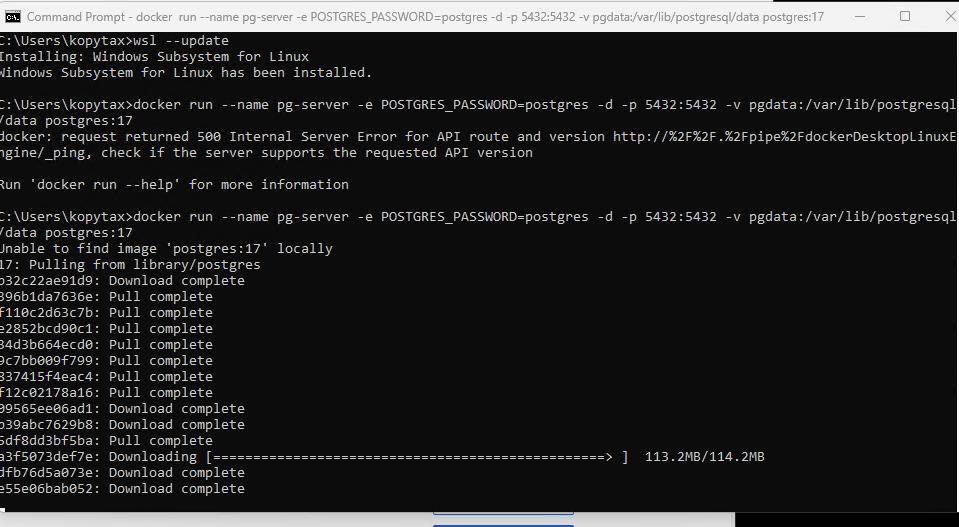
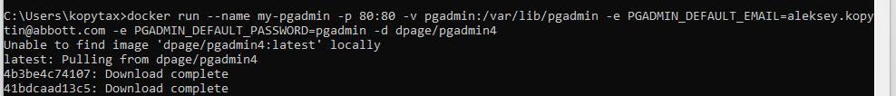
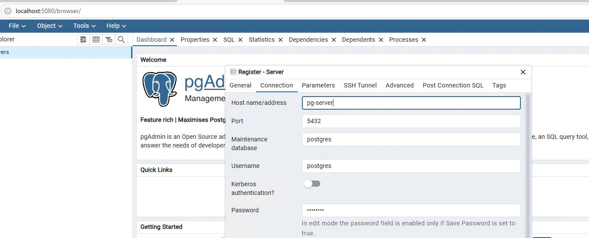
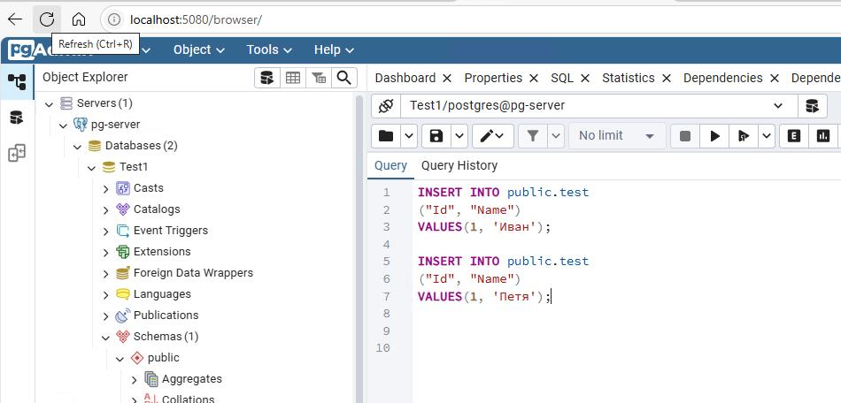
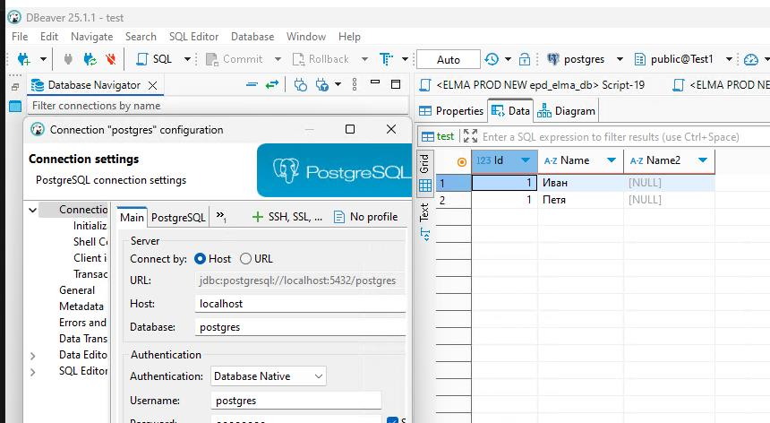
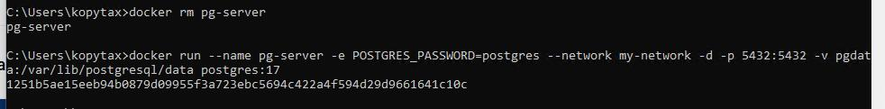

# Домашнее задание
Установка и настройка PostgteSQL в контейнере Docker:
- Развернул докер, установим Docker Desktop на Windows
- Создал сеть внутри докера командой docker network create my-network;
- развернул контейнер с PostgreSQL 17 смонтировав в него именованный volume  с именем pgdata командой:
docker run --name pg-server -e POSTGRES_PASSWORD=postgres --network my-network -d -p 5432:5432 -v pgdata:/var/lib/postgresql/data postgres:17

- Установил развернул контейнер pgadmin на основе образа pgadmin командой 
docker run --name my-pgadmin -p 5080:80 -v pgadmin:/var/lib/pgadmin -e PGADMIN_DEFAULT_EMAIL=aleksey.kopytin@abbott.com -e PGADMIN_DEFAULT_PASSWORD=pgadmin -d --network my-network  dpage/pgadmin4

- Подключится из контейнера с клиентом к контейнеру с сервером и сделать таблицу с парой строк

- Подключился к контейнеру с сервером с ноутбука

-Удалил контейнер с сервером создать его заново.
docker rm pg-server

- База и таблица остались целые.