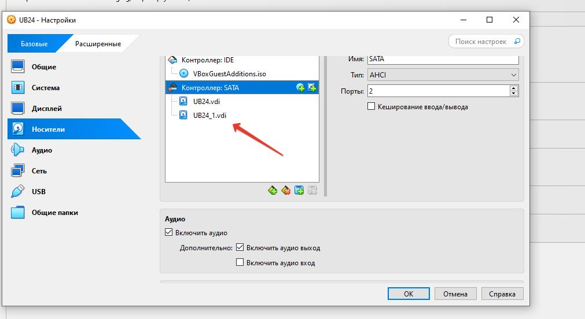

# Домашнее задание
# Физичесский уровень PostgreSQL:
- Установил Ubuntu в Oracle Virual Box
- Далее провел установку PostgreSQL 17
- Вначале зарегистрировал репозиторий
```
sudo apt install -y postgresql-common
sudo /usr/share/postgresql-common/pgdg/apt.postgresql.org.sh
```
- Установка postgresql командой:
```
--sudo apt install postgresql-17
```
- Проверил статус
```
kopytax@UB24:~$ systemctl status postgresql
● postgresql.service - PostgreSQL RDBMS
     Loaded: loaded (/usr/lib/systemd/system/postgresql.service; enabled; prese>
     Active: active (exited) since Mon 2025-08-25 16:57:23 UTC; 9min ago
   Main PID: 2394 (code=exited, status=0/SUCCESS)
        CPU: 7ms
```

- Зашел из под пользователя postgres в psql и сделал произвольную таблицу с произвольным содержимым
```
kopytax@UB24:~$ sudo -u postgres psql
[sudo] password for kopytax:
psql (17.6 (Ubuntu 17.6-1.pgdg24.04+1))
Type "help" for help.

postgres=# create table test(c1 text);
CREATE TABLE
postgres=#  insert into test values('1');
INSERT 0 1
postgres=#
```
 - Остановил кластер 
```
postgres-# \q
kopytax@UB24:~$ sudo -u postgres pg_ctlcluster 17 main stop
Warning: stopping the cluster using pg_ctlcluster will mark the systemd unit as failed. Consider using systemctl:
  sudo systemctl stop postgresql@17-main
kopytax@UB24:~$  sudo systemctl stop postgresql@17-main

```
- Добавляю дополнительный диск на VM:


- Нашел не размечанный диск, но ошибку команда выдавала нв двух мсетах, поэтому соориентировалась дополнительно по размеру.
```
kopytax@UB24:~$ lsblk
NAME   MAJ:MIN RM  SIZE RO TYPE MOUNTPOINTS
sda      8:0    0 10.3G  0 disk
├─sda1   8:1    0    1M  0 part
└─sda2   8:2    0 10.3G  0 part /
sdb      8:16   0 10.1G  0 disk
sr0     11:0    1 58.5M  0 rom
kopytax@UB24:~$ sudo parted -l
[sudo] password for kopytax:
Sorry, try again.
[sudo] password for kopytax:
Sorry, try again.
[sudo] password for kopytax:
sudo: 2 incorrect password attempts
kopytax@UB24:~$ sudo parted -l | grep Error
[sudo] password for kopytax:
Error: /dev/sdb: unrecognised disk label
Warning: Unable to open /dev/sr0 read-write (Read-only file system).  /dev/sr0
has been opened read-only.
Error: /dev/sr0: unrecognised disk label
```
- Выбираю стандарт разбиения
```
sudo parted /dev/sdb mklabel gpt
Information: You may need to update /etc/fstab.
```
- Cоздаю раздел, охватывающий весь диск:
```
 sudo parted -a opt /dev/sdb mkpart primary ext4 0% 100%
Information: You may need to update /etc/fstab.
```
Проверяем новый  доступный раздел:

```
kopytax@UB24:~$ lsblk
NAME   MAJ:MIN RM  SIZE RO TYPE MOUNTPOINTS
sda      8:0    0 10.3G  0 disk
├─sda1   8:1    0    1M  0 part
└─sda2   8:2    0 10.3G  0 part /
sdb      8:16   0 10.1G  0 disk
└─sdb1   8:17   0 10.1G  0 part
sr0     11:0    1 58.5M  0 rom
```

- Создание файловой системы на новом разделе
```
kopytax@UB24:~$ sudo mkfs.ext4 -L datapartition /dev/sdb1
mke2fs 1.47.0 (5-Feb-2023)
Creating filesystem with 2644992 4k blocks and 662256 inodes
Filesystem UUID: 139709a8-3c03-460c-8b2f-3ccceff5fb22
Superblock backups stored on blocks:
        32768, 98304, 163840, 229376, 294912, 819200, 884736, 1605632

Allocating group tables: done
Writing inode tables: done
Creating journal (16384 blocks): done
Writing superblocks and filesystem accounting information: done
```

- Просмотрим  на различные способы ссылки на новую файловую систему:
```
kopytax@UB24:~$ sudo lsblk --fs
NAME FSTYPE FSVER LABEL           UUID                                 FSAVAIL FSUSE% MOUNTPOINTS
sda                                                                             
├─sda1
│                                                                               
└─sda2
     ext4   1.0                   a7e51662-2f60-449a-a869-6487f2dd06ab    6.2G    33% /
sdb                                                                             
└─sdb1
     ext4   1.0   datapartition   139709a8-3c03-460c-8b2f-3ccceff5fb22          
sr0  iso966 Jolie VBox_GAs_7.1.12 2025-07-14-13-06-31-55  
```
- Создаем папку для postgres 
```
sudo mkdir /mnt/postgres 
```
- Сделаем пользователя postgres владельцем
```
sudo chown -R postgres:postgres /mnt/postgres
``` 
- Монтирование новой файловой системы
```
sudo mount /dev/sdb1 /mnt/postgres/
```

- Перенесите содержимое /var/lib/postgres/17 в /mnt/postgres - mv /var/lib/postgresql/17 /mnt/postgres
```
sudo mv /var/lib/postgresql/17 /mnt/postgres
```

- Попытайтесь запустить кластер - sudo -u postgres pg_ctlcluster 17 main start
- Получаем ошибку из-за того что конфинг ссылается на уже не сущетсвуюшую папку
```
kopytax@UB24:~$ sudo -u postgres pg_ctlcluster 17 main start
Error: /var/lib/postgresql/17/main is not accessible or does not exist
```
--Далее зашел в конфигоруционный файл и поменял настройки:
- В конфиге постгрес меняем путь для данных 
```
sudo nano /etc/postgresql/17/main/postgresql.conf 
```
- Устанавливаем data_directory = '/mnt/postgres/17/main' 
- После запуска ошибка о правах доступа, исправил командами:
```
sudo chmod 0700 /mnt/postgres/17/main
sudo chown postgres:postgres /mnt/postgres/17/main
```


Проверяю, что даныные на месте
```
kopytax@UB24:~$ sudo -u postgres psql
psql (17.6 (Ubuntu 17.6-1.pgdg24.04+1))
Type "help" for help.

postgres=# select * from test;
 c1
----
 1
(1 row)
```


- Задание дополнительное -  *
- Создал вторую VM, так установил на нее Ubuntu  и PostgreSQL 17 и примонтировал дополнительный диск от первой VM
 -Остановил кластер 
```
kopytax@UB24:~$ sudo -u postgres pg_ctlcluster 17 main stop
```

- Создаем папку для postgres 
```
sudo mkdir /mnt/postgres 
```
- Сделаем пользователя postgres владельцем
```
sudo chown -R postgres:postgres /mnt/postgres
``` 
- Монтирование новой файловой системы
```
sudo mount /dev/sdb1 /mnt/postgres/
```
- Смотрим. что диск примантирвался df -h -x tmpfs

```
kopytax@UB25:~$ df -h -x tmpfs
Filesystem      Size  Used Avail Use% Mounted on
/dev/sda2        15G  2.9G   12G  20% /
/dev/sdb1       9.9G   39M  9.3G   1% /mnt/postgres
```

- Удалаем каталог postgresql :  
```
kopytax@UB25:~$ sudo rm -R /var/lib/postgresql/17
```
- Меняем путь в конфигурационном файле /etc/postgresql/17/main/postgresql.conf

Запускаю кластер и проверяю статус:

```
kopytax@UB25:~$ sudo -u postgres pg_ctlcluster 17 main start
Warning: the cluster will not be running as a systemd service. Consider using systemctl:
  sudo systemctl start postgresql@17-main
Removed stale pid file.
kopytax@UB25:~$ systemctl status postgresql
● postgresql.service - PostgreSQL RDBMS
     Loaded: loaded (/usr/lib/systemd/system/postgresql.service; enabled; prese>
     Active: active (exited) since Fri 2025-08-29 17:05:43 UTC; 16min ago
   Main PID: 2526 (code=exited, status=0/SUCCESS)
        CPU: 11ms
lines 1-5/5 (END)
```

- Проверяю, что даныные на месте
```
kopytax@UB25:~$ sudo -u postgres psql
psql (17.6 (Ubuntu 17.6-1.pgdg24.04+1))
Type "help" for help.

postgres=# select * from test;
 c1
----
 1
(1 row)

postgres=#

```


