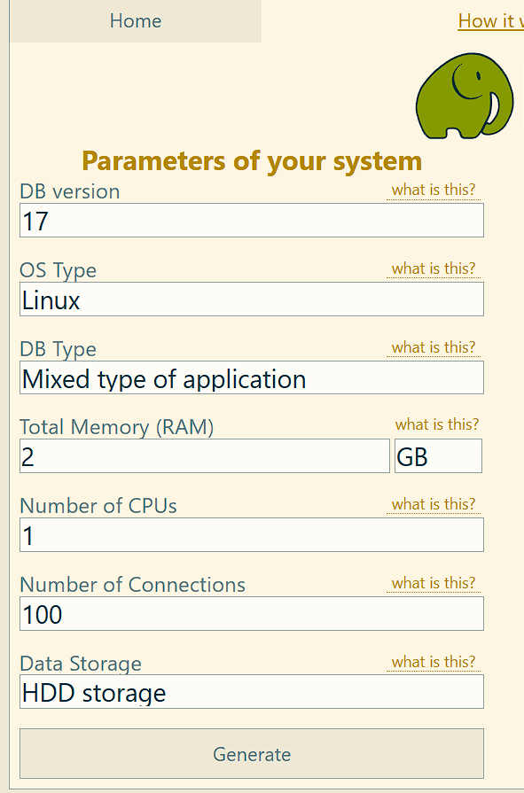

## Нагрузочное тестирование и тюнинг PostgreSQL  
### Установил PostgreSQL 17 на виртуальную машину:

### Настройка PostgreSQL

1. Ввел параметры виртульной машины в PGTune и получил необходимые настройки для  PostgreSQL:



```
# DB Version: 17
# OS Type: linux
# DB Type: mixed
# Total Memory (RAM): 2 GB
# CPUs num: 1
# Connections num: 100
# Data Storage: hdd

max_connections = 100
shared_buffers = 512MB
effective_cache_size = 1536MB
maintenance_work_mem = 128MB
checkpoint_completion_target = 0.9
wal_buffers = 16MB
default_statistics_target = 100
random_page_cost = 4
effective_io_concurrency = 2
work_mem = 2427kB
huge_pages = off
min_wal_size = 1GB
max_wal_size = 4GB
```
Добавил настройки в PostgreSQL в конец файла postgresql.conf. 

### Подготовка pgbench
```
kopytax@UB25:~$ sudo -u postgres pgbench -i -s 10 postgres
dropping old tables...
creating tables...
generating data (client-side)...
100000 of 1000000 tuples (10%) of pgbench_accounts done (elapsed 0.12 s, remaini200000 of 1000000 tuples (20%) of pgbench_accounts done (elapsed 0.62 s, remaini300000 of 1000000 tuples (30%) of pgbench_accounts done (elapsed 0.99 s, remaini400000 of 1000000 tuples (40%) of pgbench_accounts done (elapsed 1.11 s, remaini500000 of 1000000 tuples (50%) of pgbench_accounts done (elapsed 1.49 s, remaini600000 of 1000000 tuples (60%) of pgbench_accounts done (elapsed 1.80 s, remaini700000 of 1000000 tuples (70%) of pgbench_accounts done (elapsed 2.10 s, remaini800000 of 1000000 tuples (80%) of pgbench_accounts done (elapsed 2.55 s, remaini900000 of 1000000 tuples (90%) of pgbench_accounts done (elapsed 2.67 s, remaini1000000 of 1000000 tuples (100%) of pgbench_accounts done (elapsed 2.97 s, remai                                                                                vacuuming...
creating primary keys...
done in 4.74 s (drop tables 0.36 s, create tables 0.03 s, client-side generate 3.14 s, vacuum 0.17 s, primary keys 1.04 s).

```
-i — инициализация (создание таблиц и наполнение данными).
-s 10 — масштабный множитель (scale factor). При -s 1 создаётся 100 000 строк в pgbench_accounts. При -s 10 — 1 000 000 строк.


### Запуск pgbench
```
sudo -u postgres pgbench -c 100 -j 2 -P 60 -T 60
-c 100 — 100 одновременных клиентов (соединений).
-j 2 - 2 потока
-T 60 - время
-P 60 - время в секундах через которое выводить отчет

kopytax@UB25:~$ sudo -u postgres pgbench -c 100 -j 2 -P 60 -T 60
pgbench (17.6 (Ubuntu 17.6-1.pgdg24.04+1))
starting vacuum...end.
progress: 60.0 s, 225.0 tps, lat 436.494 ms stddev 595.077, 0 failed
transaction type: <builtin: TPC-B (sort of)>
scaling factor: 10
query mode: simple
number of clients: 100
number of threads: 2
maximum number of tries: 1
duration: 60 s
number of transactions actually processed: 13600
number of failed transactions: 0 (0.000%)
latency average = 440.754 ms
latency stddev = 598.436 ms
initial connection time = 495.386 ms
tps = 225.238766 (without initial connection time)
```

Итого получилось среднее занчение tps = 225.238766.

