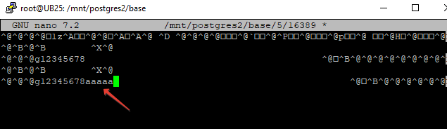

## Работа с журналами


- Добавляем максимальное время между контрольными точками (основной параметр)
checkpoint_timeout = 30s
в файл настроек 
```
kopytax@UB25:~$ sudo nano /etc/postgresql/17/main/postgresql.conf
```
- Перезапускам класте
```
sudo systemctl restart postgresql@17-main
```

### Запуск PGBENCH:
```
kopytax@UB25:~$ sudo -u postgres  pgbench -P 60 -T 600
pgbench (17.6 (Ubuntu 17.6-1.pgdg24.04+1))
starting vacuum...end.
progress: 60.0 s, 66.9 tps, lat 14.937 ms stddev 12.505, 0 failed
progress: 120.0 s, 56.0 tps, lat 17.861 ms stddev 12.164, 0 failed
progress: 180.0 s, 54.2 tps, lat 18.441 ms stddev 12.458, 0 failed
progress: 240.0 s, 54.8 tps, lat 18.236 ms stddev 11.328, 0 failed
progress: 300.0 s, 57.9 tps, lat 17.272 ms stddev 11.627, 0 failed
progress: 360.0 s, 54.8 tps, lat 18.241 ms stddev 12.173, 0 failed
progress: 420.0 s, 52.5 tps, lat 19.038 ms stddev 12.510, 0 failed
progress: 480.0 s, 55.3 tps, lat 18.072 ms stddev 12.369, 0 failed
progress: 540.0 s, 52.7 tps, lat 18.970 ms stddev 12.463, 0 failed
progress: 600.0 s, 54.4 tps, lat 18.356 ms stddev 12.588, 0 failed
transaction type: <builtin: TPC-B (sort of)>
scaling factor: 1
query mode: simple
number of clients: 1
number of threads: 1
maximum number of tries: 1
duration: 600 s
number of transactions actually processed: 33582
number of failed transactions: 0 (0.000%)
latency average = 17.865 ms
latency stddev = 12.283 ms
initial connection time = 5.428 ms
tps = 55.969480 (without initial connection time)
```
### Анализ журналов: 


- В моем случае создавалось около 13 файлов каждый размером 16MB. интервалы между их созданием — примерно 45–60 секунд. Новый WAL-файл создаётся, когда текущий заполняется, а не по таймеру.
То есть: частота создания WAL-файлов зависит от объёма записи, а не от checkpoint_timeout.
checkpoint_timeout параметр управляет частотой контрольных точек (checkpoints) — моментов, когда "грязные" страницы из shared buffers сбрасываются на диск.

- список файлов 
sudo -i
root@UB25:/mnt/postgres/17/main/pg_wal# stat -c '%y %n' * | sort

```
2025-09-26 17:35:37.789364759 +0000 0000000100000002000000F3
2025-09-26 17:36:22.668115010 +0000 0000000100000002000000F4
2025-09-26 17:37:15.619658983 +0000 0000000100000002000000F5
2025-09-26 17:38:05.266308876 +0000 0000000100000002000000F6
2025-09-26 17:38:56.384931160 +0000 0000000100000002000000F7
2025-09-26 17:39:47.073575250 +0000 0000000100000002000000F8
2025-09-26 17:40:40.445156572 +0000 0000000100000002000000F9
2025-09-26 17:41:32.060791732 +0000 0000000100000002000000FA
2025-09-26 17:42:24.990898582 +0000 0000000100000002000000FB
2025-09-26 17:43:19.179269352 +0000 0000000100000002000000FC
2025-09-26 17:44:15.801637951 +0000 0000000100000002000000FD
2025-09-26 17:45:09.297249630 +0000 0000000100000002000000FE
2025-09-26 17:46:40.631364711 +0000 00000001000000020000002B
```

### Запуск PGBENCH в асинхронном режиме

- Устанавливаем synchronous_commit = off
```
kopytax@UB25:~$ sudo systemctl restart postgresql@17-main
kopytax@UB25:~$ sudo -u postgres  pgbench -P 60 -T 600
pgbench (17.6 (Ubuntu 17.6-1.pgdg24.04+1))
starting vacuum...end.
progress: 60.0 s, 238.0 tps, lat 4.201 ms stddev 1.381, 0 failed
progress: 120.0 s, 265.2 tps, lat 3.770 ms stddev 1.282, 0 failed
progress: 180.0 s, 270.4 tps, lat 3.697 ms stddev 1.129, 0 failed
progress: 240.0 s, 306.0 tps, lat 3.268 ms stddev 1.329, 0 failed
progress: 300.0 s, 277.4 tps, lat 3.604 ms stddev 1.303, 0 failed
progress: 360.0 s, 293.2 tps, lat 3.410 ms stddev 1.418, 0 failed
progress: 420.0 s, 294.5 tps, lat 3.394 ms stddev 1.070, 0 failed
progress: 480.0 s, 331.4 tps, lat 3.017 ms stddev 1.376, 0 failed
progress: 540.0 s, 281.6 tps, lat 3.550 ms stddev 1.169, 0 failed
progress: 600.0 s, 228.7 tps, lat 4.371 ms stddev 2.186, 0 failed
transaction type: <builtin: TPC-B (sort of)>
scaling factor: 1
query mode: simple
number of clients: 1
number of threads: 1
maximum number of tries: 1
duration: 600 s
number of transactions actually processed: 167185
number of failed transactions: 0 (0.000%)
latency average = 3.588 ms
latency stddev = 1.428 ms
initial connection time = 4.778 ms
tps = 278.642272 (without initial connection time)

```
- В синхронном режиме каждая транзакция ждет физической записи на диск
- В асинхронном режиме операции накапливаются в памяти и записываются пачками, поэтому быстрее, но при сбое есть риск потерять больше данных.

### Создайте новый кластер с включенной контрольной суммой страниц.

```
kopytax@UB25:~$ sudo pg_createcluster 17 postgres2 --start --datadir=/mnt/postgres2 --port=5433 -- --data-checksums
Creating new PostgreSQL cluster 17/postgres2 ...
/usr/lib/postgresql/17/bin/initdb -D /mnt/postgres2 --auth-local peer --auth-host scram-sha-256 --no-instructions --data-checksums
The files belonging to this database system will be owned by user "postgres".
This user must also own the server process.

The database cluster will be initialized with locale "en_US.UTF-8".
The default database encoding has accordingly been set to "UTF8".
The default text search configuration will be set to "english".

Data page checksums are enabled.

fixing permissions on existing directory /mnt/postgres2 ... ok
creating subdirectories ... ok
selecting dynamic shared memory implementation ... posix
selecting default "max_connections" ... 100
selecting default "shared_buffers" ... 128MB
selecting default time zone ... Etc/UTC
creating configuration files ... ok
running bootstrap script ... ok
performing post-bootstrap initialization ... ok
syncing data to disk ... ok
Ver Cluster   Port Status Owner    Data directory Log file
17  postgres2 5433 online postgres /mnt/postgres2 /var/log/postgresql/postgresql-17-postgres2.log
kopytax@UB25:~$

```
### Создаем таблицу и вставляем данные:
```
sudo -u postgres psql  -p 5433
postgres=# CREATE TABLE test(id serial,name char(50));
CREATE TABLE
postgres=# INSERT INTO test(name) SELECT '12345678' FROM generate_series(1,100);
INSERT 0 100
postgres=# SELECT pg_relation_filepath('test');
 pg_relation_filepath
----------------------
 base/5/16389
(1 row)

```
### Меняем содержимое:

```
Стоп кластера:
kopytax@UB25:~$ sudo pg_ctlcluster 17 postgres2 stop
```
Добвит  символов sudo nano /mnt/postgres2/base/5/16389 :

```
Старт кластерар:
kopytax@UB25:~$ sudo pg_ctlcluster 17 postgres2 start
```
### Выполняем запрос на выборку данных:

```
postgres=# select * from test;
WARNING:  page verification failed, calculated checksum 25699 but expected 43904
ERROR:  invalid page in block 0 of relation base/5/16389

```
Видим, что сработала проверка на контрольную сумму.
Её можно обойти командой
postgres=# SET ignore_checksum_failure = on;
SET
postgres=# SELECT * FROM test;
WARNING:  page verification failed, calculated checksum 25699 but expected 43904
 id  |                        name
-----+----------------------------------------------------
   1 | 12345678
   2 | 12345678
   3 | 12345678
   4 | 12345678
   5 | 12345678
   6 | 12345678
   7 | 12345678
   8 | 12345678
   9 | 12345678
  13 | 12345678
  11 | 12345678
  12 | 12345678
  13 | 12345678
  14 | 12345678
  15 | 12345678
  16 | 12345678
  17 | 12345678
  18 | 12345678
  19 | 12345678
  20 | 12345678
  21 | 12345678

