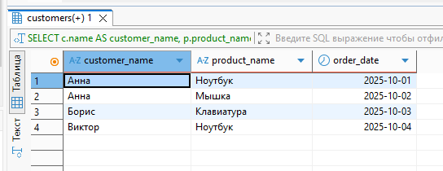

## ДЗ: Работа с join'ами, статистикой

-  Создаём базу:  
```
CREATE DATABASE shop
    WITH 
    OWNER = postgres
    ENCODING = 'UTF8'
    TEMPLATE = template0;
```
 
- Создаем таблицы:  
```
-- Таблица клиентов
CREATE TABLE customers (
    customer_id SERIAL PRIMARY KEY,
    name VARCHAR(100) NOT NULL
);

-- Таблица товаров
CREATE TABLE products (
    product_id SERIAL PRIMARY KEY,
    product_name VARCHAR(100) NOT NULL,
    price DECIMAL(10, 2)
);

-- Таблица заказов
CREATE TABLE orders (
    order_id SERIAL PRIMARY KEY,
    customer_id INT REFERENCES customers(customer_id),
    product_id INT REFERENCES products(product_id),
    order_date DATE
);
```
- Наполнение таблиц данными
```
-- Добавляем клиентов
INSERT INTO customers (name) VALUES
('Анна'),
('Борис'),
('Виктор'),
('Галина');

-- Добавляем товары
INSERT INTO products (product_name, price) VALUES
('Ноутбук', 50000.00),
('Мышка', 1500.00),
('Клавиатура', 3000.00),
('Монитор', 20000.00);

-- Добавляем заказы
INSERT INTO orders (customer_id, product_id, order_date) VALUES
(1, 1, '2025-10-01'),  -- Анна купила ноутбук
(1, 2, '2025-10-02'),  -- Анна купила мышку
(2, 3, '2025-10-03'),  -- Борис купил клавиатуру
(3, 1, '2025-10-04');  -- Виктор купил ноутбук
-- Галина (customer_id=4) не делала заказов
-- Товар "Монитор" (product_id=4) никто не покупал
```

- 1. Прямое соединение (INNER JOIN)
Соединяем заказы с клиентами и товарами — только те записи, где есть совпадения во всех таблицах.

```
-- INNER JOIN: показываем только те заказы, у которых есть и клиент, и товар
SELECT 
    c.name AS customer_name,
    p.product_name,
    o.order_date
FROM orders o
INNER JOIN customers c ON o.customer_id = c.customer_id
INNER JOIN products p ON o.product_id = p.product_id;
```


- 2. Левостороннее соединение (LEFT JOIN) Показываем всех клиентов, даже если у них нет заказов.
```
-- LEFT JOIN: все клиенты + их заказы (если есть)
SELECT 
    c.name AS customer_name,
    p.product_name,
    o.order_date
FROM customers c
LEFT JOIN orders o ON c.customer_id = o.customer_id
LEFT JOIN products p ON o.product_id = p.product_id;
```


- 3. Кросс-соединение (CROSS JOIN)
```
-- CROSS JOIN: декартово произведение клиентов и товаров
SELECT 
    c.name AS customer_name,
    p.product_name
FROM customers c
CROSS JOIN products p;
```


- 4. Полное внешнее соединение (FULL OUTER JOIN)

Возвращает все записи из всех соединенных таблиц
Если совпадения нет, в результирующих столбцах будет NULL
```
-- FULL OUTER JOIN: все клиенты и все товары, даже без связей через заказы
SELECT 
    c.name AS customer_name,
    p.product_name,
    o.order_date
FROM orders o
FULL OUTER JOIN customers c ON o.customer_id = c.customer_id
FULL OUTER JOIN products p ON o.product_id = p.product_id;
```


- 5. Комбинированный запрос с разными типами соединений
Покажем всех клиентов (LEFT JOIN), их заказы, соответствующие товары (INNER JOIN),
и добавим информацию о товарах, которые никто не покупал (RIGHT JOIN с продуктами).
```
-- Комбинированный запрос:
-- 1. Все клиенты (LEFT JOIN с заказами)
-- 2. Только существующие товары в заказах (INNER JOIN)
-- 3. Дополнительно добавляем товары без заказов через RIGHT JOIN на подзапрос
SELECT 
    COALESCE(c.name, 'Без клиента') AS customer_name,
    COALESCE(p.product_name, 'Товар без заказа') AS product_name,
    o.order_date
FROM customers c
LEFT JOIN orders o ON c.customer_id = o.customer_id
INNER JOIN products p ON o.product_id = p.product_id

UNION

-- Добавляем товары, которые никто не покупал
SELECT 
    'Без клиента' AS customer_name,
    p.product_name,
    NULL AS order_date
FROM products p
LEFT JOIN orders o ON p.product_id = o.product_id
WHERE o.product_id IS NULL;
```
