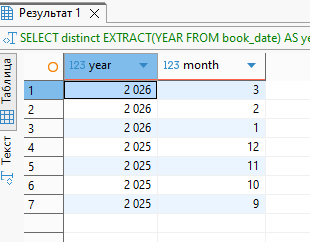

## ДЗ: Секционирование таблицы


### 1. Анализ структуры данных
Базу взял по ссылке https://postgrespro.ru/education/demodb.

В демонстрационной базе данных (авиаперевозки) таблица bookings содержит следующие поля:
```
bookings (
  book_ref    CHAR(6) PRIMARY KEY,
  book_date   TIMESTAMP NOT NULL,
  total_amount NUMERIC(10,2) NOT NULL
)
```
book_date — дата и время оформления бронирования.
Объем данных: в demo-20250901-6m.sql.gz версии — 2486710  записей.

### 2. Выбор таблицы для секционирования
Выбрана таблица bookings, потому что:

Она крупная и растёт со временем.
Имеет естественный ключ для секционирования — book_date.
Запросы часто фильтруют по дате → секционирование по диапазону дат позволит PostgreSQL использовать partition pruning, значительно ускоряя выборку.

### 3. Тип секционирования
Выбрано секционирование по диапазону (RANGE) на основе поля book_date, с разбивкой по месяцам.

Преимущества:

Легко управлять архивными данными (удаление старых месяцев).
Запросы по месяцам будут сканировать только нужную секцию.

 SQL-скрипт реализации:

 ```
-- 1. Переименовываем исходную таблицу
ALTER TABLE bookings RENAME TO bookings_old;

-- 2. Создаём новую секционированную таблицу
CREATE TABLE bookings (
    book_ref     CHAR(6),
    book_date    TIMESTAMP NOT NULL,
    total_amount NUMERIC(10,2) NOT NULL,
    PRIMARY KEY (book_ref, book_date)  -- теперь включает столбец секционирования
) PARTITION BY RANGE (book_date);

-- 3. Определяем диапазоны (на основе демо-данных: )

SELECT distinct 
    EXTRACT(YEAR FROM book_date) AS year,
    EXTRACT(MONTH FROM book_date) AS month
FROM bookings.bookings_old
order by EXTRACT(YEAR FROM book_date) desc, EXTRACT(MONTH FROM book_date) desc ;
 ```
 

  ```
--Данные за 2025-09 – 2026-03 (6 месяцев)
CREATE TABLE bookings_202509 PARTITION OF bookings
    FOR VALUES FROM ('2025-09-01') TO ('2025-10-01');
CREATE TABLE bookings_202510 PARTITION OF bookings
    FOR VALUES FROM ('2025-10-01') TO ('2025-11-01');
CREATE TABLE bookings_202511 PARTITION OF bookings
    FOR VALUES FROM ('2025-11-01') TO ('2025-12-01');
CREATE TABLE bookings_202512 PARTITION OF bookings
    FOR VALUES FROM ('2025-12-01') TO ('2026-01-01');
CREATE TABLE bookings_202601 PARTITION OF bookings
    FOR VALUES FROM ('2026-01-01') TO ('2026-02-01');
CREATE TABLE bookings_202602 PARTITION OF bookings
    FOR VALUES FROM ('2026-02-01') TO ('2026-03-01');
CREATE TABLE bookings_202603 PARTITION OF bookings
    FOR VALUES FROM ('2026-03-01') TO ('2026-04-01');

-- 4. Переносим данные из старой таблицы
INSERT INTO bookings SELECT * FROM bookings_old;

-- 5. Проверяем распределение
SELECT distinct 
    EXTRACT(YEAR FROM book_date) AS year,
    EXTRACT(MONTH FROM book_date) AS month
FROM bookings_202509
order by EXTRACT(YEAR FROM book_date) desc, EXTRACT(MONTH FROM book_date) desc ;

SELECT distinct 
    EXTRACT(YEAR FROM book_date) AS year,
    EXTRACT(MONTH FROM book_date) AS month
FROM bookings_202510
order by EXTRACT(YEAR FROM book_date) desc, EXTRACT(MONTH FROM book_date) desc ;

SELECT distinct 
    EXTRACT(YEAR FROM book_date) AS year,
    EXTRACT(MONTH FROM book_date) AS month
FROM bookings_202511
order by EXTRACT(YEAR FROM book_date) desc, EXTRACT(MONTH FROM book_date) desc ;

SELECT distinct 
    EXTRACT(YEAR FROM book_date) AS year,
    EXTRACT(MONTH FROM book_date) AS month
FROM bookings_202512
order by EXTRACT(YEAR FROM book_date) desc, EXTRACT(MONTH FROM book_date) desc ;

SELECT distinct 
    EXTRACT(YEAR FROM book_date) AS year,
    EXTRACT(MONTH FROM book_date) AS month
FROM bookings_202512
order by EXTRACT(YEAR FROM book_date) desc, EXTRACT(MONTH FROM book_date) desc ;

SELECT distinct 
    EXTRACT(YEAR FROM book_date) AS year,
    EXTRACT(MONTH FROM book_date) AS month
FROM bookings_202601
order by EXTRACT(YEAR FROM book_date) desc, EXTRACT(MONTH FROM book_date) desc ;

SELECT distinct 
    EXTRACT(YEAR FROM book_date) AS year,
    EXTRACT(MONTH FROM book_date) AS month
FROM bookings_202602
order by EXTRACT(YEAR FROM book_date) desc, EXTRACT(MONTH FROM book_date) desc ;

SELECT distinct 
    EXTRACT(YEAR FROM book_date) AS year,
    EXTRACT(MONTH FROM book_date) AS month
FROM bookings_202603
order by EXTRACT(YEAR FROM book_date) desc, EXTRACT(MONTH FROM book_date) desc ;

```

  ### 4. Тестирование и оптимизация
 - Запрос: все бронирования за декабрь 2025  до секционирования
EXPLAIN (ANALYZE, BUFFERS)
SELECT COUNT(*) FROM bookings_old
WHERE book_date >= '2025-12-01' AND book_date < '2026-01-01';

```
Finalize Aggregate  (cost=32832.61..32832.62 rows=1 width=8) (actual time=139.485..151.931 rows=1 loops=1)
  Buffers: shared hit=15856
  ->  Gather  (cost=32832.40..32832.61 rows=2 width=8) (actual time=133.891..151.303 rows=3 loops=1)
        Workers Planned: 2
        Workers Launched: 2
        Buffers: shared hit=15856
        ->  Partial Aggregate  (cost=31832.40..31832.41 rows=1 width=8) (actual time=118.741..118.742 rows=1 loops=3)
              Buffers: shared hit=15856
              ->  Parallel Seq Scan on bookings_old  (cost=0.00..31397.94 rows=173785 width=0) (actual time=0.132..111.189 rows=137008 loops=3)
                    Filter: ((book_date >= '2025-12-01 00:00:00+03'::timestamp with time zone) AND (book_date < '2026-01-01 00:00:00+03'::timestamp with time zone))
                    Rows Removed by Filter: 691895
                    Buffers: shared hit=15856
Planning:
  Buffers: shared hit=9
Planning Time: 0.112 ms
Execution Time: 151.965 ms
```
 - Запрос: все бронирования за декабрь 2025 с секционированием
 ```
 Finalize Aggregate  (cost=7849.23..7849.24 rows=1 width=8) (actual time=50.779..54.945 rows=1 loops=1)
  Buffers: shared hit=2618
  ->  Gather  (cost=7849.12..7849.23 rows=1 width=8) (actual time=47.346..54.936 rows=2 loops=1)
        Workers Planned: 1
        Workers Launched: 1
        Buffers: shared hit=2618
        ->  Partial Aggregate  (cost=6849.12..6849.13 rows=1 width=8) (actual time=43.058..43.060 rows=1 loops=2)
              Buffers: shared hit=2618
              ->  Parallel Seq Scan on bookings_202512 bookings  (cost=0.00..6244.69 rows=241770 width=0) (actual time=0.017..30.122 rows=205512 loops=2)
                    Filter: ((book_date >= '2025-12-01 00:00:00'::timestamp without time zone) AND (book_date < '2026-01-01 00:00:00'::timestamp without time zone))
                    Buffers: shared hit=2618
Planning:
  Buffers: shared hit=76 dirtied=1
Planning Time: 1.020 ms
Execution Time: 54.976 ms
```

Ускорение запросов по диапазону дат в 3 раза.


