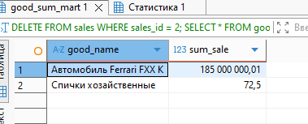

## ДЗ: Триггеры, поддержка заполнения витрин


### 1. Создаем таблицы и заполняем данными
```
CREATE SCHEMA pract_functions;

SET search_path = pract_functions, publ

-- товары:
CREATE TABLE goods
(
    goods_id    integer PRIMARY KEY,
    good_name   varchar(63) NOT NULL,
    good_price  numeric(12, 2) NOT NULL CHECK (good_price > 0.0)
);
INSERT INTO goods (goods_id, good_name, good_price)
VALUES 	(1, 'Спички хозайственные', .50),
		(2, 'Автомобиль Ferrari FXX K', 185000000.01);

-- Продажи
CREATE TABLE sales
(
    sales_id    integer GENERATED ALWAYS AS IDENTITY PRIMARY KEY,
    good_id     integer REFERENCES goods (goods_id),
    sales_time  timestamp with time zone DEFAULT now(),
    sales_qty   integer CHECK (sales_qty > 0)
);

INSERT INTO sales (good_id, sales_qty) VALUES (1, 10), (1, 1), (1, 120), (2, 1);

-- отчет:
SELECT G.good_name, sum(G.good_price * S.sales_qty)
FROM goods G
INNER JOIN sales S ON S.good_id = G.goods_id
GROUP BY G.good_name;

CREATE TABLE good_sum_mart
(
	good_name   varchar(63) NOT NULL,
	sum_sale	numeric(16, 2)NOT NULL
);
```

### 2. Пишем триггер
```
-- Создаем функцию для обновления витрины
CREATE OR REPLACE FUNCTION update_good_sum_mart()
RETURNS TRIGGER AS $$
BEGIN
    -- Обработка операции DELETE
    IF TG_OP = 'DELETE' THEN
        UPDATE good_sum_mart 
        SET sum_sale = sum_sale - (SELECT good_price FROM goods WHERE goods_id = OLD.good_id) * OLD.sales_qty
        WHERE good_name = (SELECT good_name FROM goods WHERE goods_id = OLD.good_id);
        
        -- Если сумма стала 0 или меньше, удаляем запись
        DELETE FROM good_sum_mart 
        WHERE good_name = (SELECT good_name FROM goods WHERE goods_id = OLD.good_id) 
        AND sum_sale <= 0;
        
        RETURN OLD;
    
    -- Обработка операции INSERT
    ELSIF TG_OP = 'INSERT' THEN
        -- Проверяем, существует ли уже запись для этого товара
        IF EXISTS (SELECT 1 FROM good_sum_mart WHERE good_name = (SELECT good_name FROM goods WHERE goods_id = NEW.good_id)) THEN
            UPDATE good_sum_mart 
            SET sum_sale = sum_sale + (SELECT good_price FROM goods WHERE goods_id = NEW.good_id) * NEW.sales_qty
            WHERE good_name = (SELECT good_name FROM goods WHERE goods_id = NEW.good_id);
        ELSE
            INSERT INTO good_sum_mart (good_name, sum_sale)
            SELECT 
                g.good_name,
                g.good_price * NEW.sales_qty
            FROM goods g 
            WHERE g.goods_id = NEW.good_id;
        END IF;
        
        RETURN NEW;
    
    -- Обработка операции UPDATE
    ELSIF TG_OP = 'UPDATE' THEN
        -- Если изменился товар, нужно обработать как DELETE + INSERT
        IF OLD.good_id != NEW.good_id THEN
            -- Удаляем из старого товара
            UPDATE good_sum_mart 
            SET sum_sale = sum_sale - (SELECT good_price FROM goods WHERE goods_id = OLD.good_id) * OLD.sales_qty
            WHERE good_name = (SELECT good_name FROM goods WHERE goods_id = OLD.good_id);
            
            -- Добавляем к новому товару
            IF EXISTS (SELECT 1 FROM good_sum_mart WHERE good_name = (SELECT good_name FROM goods WHERE goods_id = NEW.good_id)) THEN
                UPDATE good_sum_mart 
                SET sum_sale = sum_sale + (SELECT good_price FROM goods WHERE goods_id = NEW.good_id) * NEW.sales_qty
                WHERE good_name = (SELECT good_name FROM goods WHERE goods_id = NEW.good_id);
            ELSE
                INSERT INTO good_sum_mart (good_name, sum_sale)
                SELECT 
                    g.good_name,
                    g.good_price * NEW.sales_qty
                FROM goods g 
                WHERE g.goods_id = NEW.good_id;
            END IF;
        ELSE
            -- Если товар не менялся, только количество
            UPDATE good_sum_mart 
            SET sum_sale = sum_sale + (SELECT good_price FROM goods WHERE goods_id = NEW.good_id) * (NEW.sales_qty - OLD.sales_qty)
            WHERE good_name = (SELECT good_name FROM goods WHERE goods_id = NEW.good_id);
        END IF;
        
        RETURN NEW;
    END IF;
    
    RETURN NULL;
END;
$$ LANGUAGE plpgsql;

-- Создаем триггер
CREATE TRIGGER sales_trigger
    AFTER INSERT OR UPDATE OR DELETE ON pract_functions.sales
    FOR EACH ROW EXECUTE FUNCTION update_good_sum_mart();

```
- Инициализация витрины начальными данными:

```
-- Заполняем витрину начальными данными
INSERT INTO pract_functions.good_sum_mart (good_name, sum_sale)
SELECT G.good_name, sum(G.good_price * S.sales_qty)
FROM pract_functions.goods G
INNER JOIN pract_functions.sales S ON S.good_id = G.goods_id
GROUP BY G.good_name;
```

-Тестирование триггера:
```
-- Тест INSERT
INSERT INTO sales (good_id, sales_qty) VALUES (1, 5);
-- Проверяем витрину
SELECT * FROM good_sum_mart;
```


```

-- Тест UPDATE
UPDATE sales SET sales_qty = 20 WHERE sales_id = 1;
-- Проверяем витрину
SELECT * FROM good_sum_mart;
```


```
-- Тест DELETE
DELETE FROM sales WHERE sales_id = 2;
-- Проверяем витрину
SELECT * FROM good_sum_mart;
```


### 3. Преимущества схемы с витриной и триггером:
- Производительность - данные предварительно агрегированы, отчет формируется мгновенно.

- Консистентность данных при изменении цен - если цена товара изменится, исторические продажи останутся с теми ценами, которые были на момент продажи. В отчете "по требованию" пришлось бы хранить историю цен или использовать некорректные текущие цены для исторических данных.

- Актуальность данных - витрина всегда содержит самые свежие данные без необходимости выполнения тяжелых агрегирующих запросов.

- Снижение нагрузки на БД - агрегация происходит постепенно при каждой операции, а не одним тяжелым запросом.

- Поддержка реальной истории - витрина может отражать сумму продаж по фактическим ценам на момент совершения продажи, что критически важно для финансовой отчетности.

- Возможность расширения - можно добавить дополнительные метрики в витрину (средний чек, количество чеков и т.д.).